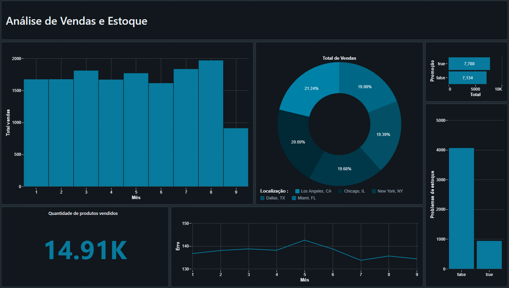

# Projeto de Análise de Estoque e Previsão de Demanda no Databricks

Este projeto utiliza dados do Walmart para realizar análises de estoque, previsões de demanda e outras métricas importantes relacionadas ao desempenho de vendas. A seguir, estão as instruções para execução do projeto.

## Dashboard Desenvolvido

Abaixo está uma prévia do dashboard que será desenvolvido neste projeto. A imagem está salva dentro do repositório e pode ser encontrada no arquivo `dashboard_preview.png`.



## Passos para Execução

### 1. Upload dos Dados
- Faça o upload do arquivo `walmart.csv` que está na pasta `data` do repositório para o DBFS no Databricks.

### 2. Clonagem do Repositório
- Clone este repositório para dentro do ambiente do Databricks.

```bash
git clone https://github.com/SamuelEngMek/databricks-spark-analytics.git
```

### 3. Inicializar o Cluster
- Inicie o cluster no Databricks.

### 4. Execução dos Notebooks
1. **Notebook `data_exploration`**:
   - Execute o notebook `data_exploration` que contém instruções passo a passo para análise inicial dos dados.

2. **Notebook `stock_analysis_demand_forecast`**:
   - Execute o notebook `stock_analysis_demand_forecast` para realizar análises de estoque, previsões e demandas com base nos dados.

### 5. Execução do Script
- Execute o script `product_demand_deficit_analysis.py` localizado na pasta `scripts`. Este script:
  - Lê dados de uma tabela no formato Parquet.
  - Gera vários DataFrames para análises detalhadas.
  - Salva os resultados processados no DBFS para uso posterior.

### 6. Importação e Visualização do Dashboard
- No repositório, há um arquivo `Dashboard.lvdash.json`.
- Importe este arquivo na aba **Dashboard** do Databricks.
- O arquivo automaticamente executará as queries e montará o dashboard com visualizações baseadas nos dados processados.

## Detalhes do Script `product_demand_deficit_analysis.py`
O script realiza as seguintes operações:
- Análise de vendas sazonais.
- Avaliação de performance de promoções.
- Cálculo do erro de previsão.
- Impacto dos "stockouts" (falta de estoque).
- Performance de vendas por localização de loja.
- Vendas por dia da semana e condições climáticas.
- Identificação de produtos com estoque abaixo do ponto de reposição.
- Salvamento dos resultados processados em arquivos Parquet no DBFS.

## Queries Utilizadas no Dashboard
- As tabelas temporárias criadas para visualizações incluem:

```sql
-- Criar uma tabela temporária para consultar os resultados de vendas sazonais
CREATE OR REPLACE TEMP VIEW seasonal_sales AS
SELECT * FROM parquet.`dbfs:/Data/seasonal_sales.parquet`;

-- Consultar a tabela
SELECT * FROM seasonal_sales;

-- Criar a tabela temporária para performance de promoções
CREATE OR REPLACE TEMP VIEW promotion_performance AS
SELECT * FROM parquet.`dbfs:/Data/promotion_performance.parquet`;
SELECT * FROM promotion_performance LIMIT 10;

-- Criar a tabela temporária para erro de previsão
CREATE OR REPLACE TEMP VIEW forecast_error AS
SELECT * FROM parquet.`dbfs:/Data/forecast_error.parquet`;
SELECT * FROM forecast_error LIMIT 10;

-- Criar a tabela temporária para performance de lojas
CREATE OR REPLACE TEMP VIEW store_performance AS
SELECT * FROM parquet.`dbfs:/Data/store_performance.parquet`;
SELECT * FROM store_performance LIMIT 10;

-- Criar a tabela temporária para vendas por produto
CREATE OR REPLACE TEMP VIEW product_sales AS
SELECT * FROM parquet.`dbfs:/Data/product_sales.parquet`;
SELECT * FROM product_sales;

-- Criar a tabela temporária para problemas de inventário
CREATE OR REPLACE TEMP VIEW inventory_issues AS
SELECT * FROM parquet.`dbfs:/Data/inventory_issues.parquet`;
SELECT * FROM inventory_issues;
```

Com isso, o dashboard apresentará as principais métricas de desempenho e insights baseados nos dados processados. 

---
Caso tenha dúvidas ou sugestões, sinta-se à vontade para entrar em contato.

